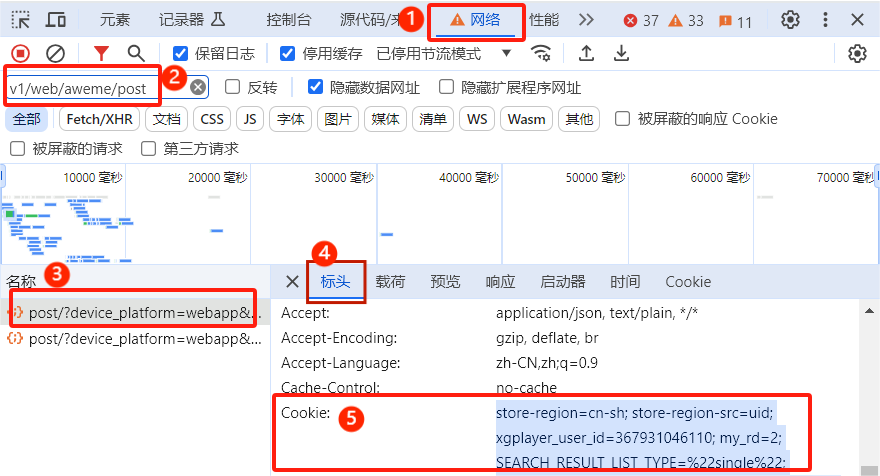

# 抖音Cookie获取指南

由于Chrome浏览器的新版本加密机制，自动提取cookie功能无法正常工作。您需要手动获取cookie。

## 方法一：通过网络请求获取Cookie

1. **打开开发者工具的网络标签**
   - 按 `F12` -> 点击"网络"(Network)标签
   - 勾选"保留日志"选项

2. **刷新页面**
   - 按 `F5` 刷新抖音页面

3. **查找请求**
   - 在网络请求列表中搜索 `v1/web/aweme/post` 的请求
   - 点击该请求

4. **复制Cookie**
   - 在"请求标头"中找到 `Cookie:` 行
   - 复制整个cookie字符串

## 方法二：使用cURL命令

1. **获取cURL命令**
   - 在网络标签中右键点击任意请求
   - 选择"复制" -> "复制为cURL (bash)"

2. **提取Cookie**
   - 从cURL命令中找到 `-H 'cookie: ...'` 部分
   - 复制引号内的cookie字符串

## 常见问题

### Q: 为什么自动提取不工作？
A: Chrome 127+ 版本使用了新的加密机制（App-Bound Encryption），现有的cookie提取库无法解密。这是一个安全特性，需要手动获取。

### Q: Cookie多久会过期？
A: 抖音的cookie通常在几天到几周内过期，具体取决于您的登录状态和安全设置。

## 保存Cookie

获取有效的cookie后，程序会自动保存到 `config/cookie.txt` 文件中，下次使用时会自动加载。

---

**注意：** 请不要与他人分享您的cookie，这相当于分享您的登录凭据。

https://www.douyin.com/user/MS4wLjABAAAA_W3WHdo9DWZ8dtbASxRQq9UpG5MLOrfa6Pgz4CpfVTM

https://www.douyin.com/user/MS4wLjABAAAAEi7nHMJG0OTV6GxYBeDCZGZ4AER85bEE8YZPRulWNIg

https://www.douyin.com/user/MS4wLjABAAAAkOG7Gd5jobSznpJgEgXB5Z1sl7W2DfccDTFLJ8AVq3I
